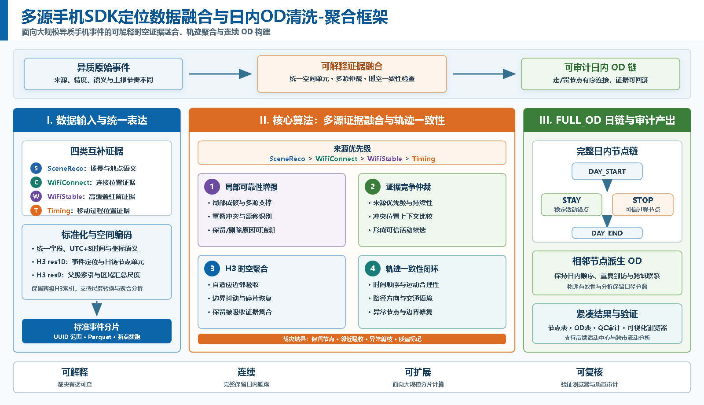
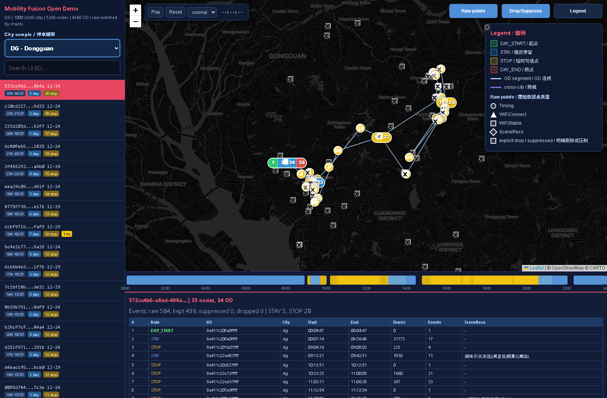

# ???? SDK ????????? OD ??-????

[English](README_en.md) | [?? Demo / Live Demo](https://yecao02.github.io/Mobility-fusion-open/demo/)

???? **Mobility Fusion** ???????????? PioneerData ???? SDK ????????????????????????????? `FULL_OD` ???????????????? demo ????????????????????????



## ?? Demo

[](https://yecao02.github.io/Mobility-fusion-open/demo/)

Demo ???[https://yecao02.github.io/Mobility-fusion-open/demo/](https://yecao02.github.io/Mobility-fusion-open/demo/)

Demo ????????????????????

- `processed`???????? `FULL_OD` H3 ??? OD ??
- `raw`???? uuid-day ???????????????????????????????

??????????????????? 1000 ? uuid-day?? 9000 ? uuid-day???????????????????????

## ????

???????

- `SceneReco`????? / POI ????
- `WiFiConnect`?Wi-Fi ?????
- `WiFiStable`??? Wi-Fi ?????
- `Timing`??? timing / GPS ?????

????????

```text
SceneReco > WiFiConnect > WiFiStable > Timing
```

???? demo ?? `FULL_OD` ?????????????H3 ??????????????????????????????????? `DAY_START / STAY / STOP / DAY_END` ??????????? OD ??

## Demo ????

??????????????????

- `K`?????????????????????????
- `S`??????????? H3 ????????????????????????
- `D`??????????????????

???????? demo ?????????????????????????

## ????

```text
.
??? assets/figures/
?   ??? full_od_strategy_framework_public_zh.png
?   ??? full_od_strategy_framework_public_en.png
?   ??? demo_preview.png
??? demo/
?   ??? index.html
?   ??? data/
?       ??? manifest.json
?       ??? processed/
?       ??? raw/
??? scripts/
    ??? build_open_demo_data.py
```

## ?????? Demo ??

??????????????

```text
S:\GEO BIG data\Greater Bay Area data_operators 500G\mobility_fusion_production_v0_4_0
```

?????

```powershell
& "E:\ANACONDA\envs\GEO\python.exe" ".\scriptsuild_open_demo_data.py" `
  --out ".\demo\data" `
  --per-city 1000
```

???? Polars ?????????? Parquet????????????????
