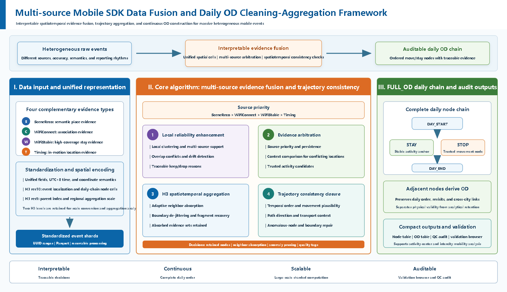

# Multi-source Mobile SDK Positioning Fusion and Daily OD Cleaning-Aggregation Framework

[中文](README.md) | [Live Demo](https://yecao02.github.io/Mobility-fusion-open/demo/) | [Shanghai sample replay](https://yecao02.github.io/Mobility-fusion-open/demo/shanghai-validation/)

This repository is the public demonstration version of **Mobility Fusion**. It shows how heterogeneous PioneerData mobile SDK events are standardized, fused, audited, and converted into interpretable daily `FULL_OD` chains. The public repository contains framework documentation, sampled demo data, and an interactive browser. It does not include full raw data or private production configuration.



## Live Demo

[](https://yecao02.github.io/Mobility-fusion-open/demo/)

Greater Bay Area demo: [https://yecao02.github.io/Mobility-fusion-open/demo/](https://yecao02.github.io/Mobility-fusion-open/demo/)

Shanghai sample replay: [https://yecao02.github.io/Mobility-fusion-open/demo/shanghai-validation/](https://yecao02.github.io/Mobility-fusion-open/demo/shanghai-validation/)

The demo loads city-date samples and visualizes two linked data layers:

- `processed`: cleaned `FULL_OD` H3 nodes and OD segments generated by the original `mobility-fusion` production pipeline.
- `raw`: standardized source events for the same uuid-day samples, used to audit captured, absorbed, suppressed, and dropped events.

The GBA sample contains about 1000 uuid-days per mainland Greater Bay Area city, 9000 uuid-days in total. The Shanghai page is not a standalone quality-validation workflow. It samples raw `residence_*` gzip files from `S:\GEO BIG data\Shanghai-2026`, restores SceneReco `p_name` values from the same directory's `poi_info` dictionary by `p_id`, rewrites the sample into the original pipeline's `unified_points` raw-input format, runs the same local `FULL_OD` production pipeline, and then converts those outputs into the same public demo `manifest + processed/raw` shard contract.

The Shanghai sample covers 2026-05-01 through 2026-05-14. It takes 100 uuid-days per date by first-appearance order in `WifiStable`: day 1 uses ranks 1-100, day 2 uses ranks 201-300, and so on. Events at or after 2026-05-15 00:00:00 are filtered out.

## Data Schema

The workflow fuses four event streams:

- `SceneReco`: semantic place-recognition / POI events.
- `WiFiConnect`: Wi-Fi association events.
- `WiFiStable`: stable Wi-Fi anchor events.
- `Timing`: cellular timing / GPS-like spatiotemporal events.

Primary evidence priority:

```text
SceneReco > WiFiConnect > WiFiStable > Timing
```

The public demo uses the `FULL_OD` view. After event standardization, H3 encoding, local support checks, neighbor absorption, de-jittering, speed checks, and context checks, the pipeline retains continuous daily `DAY_START / STAY / STOP / DAY_END` nodes and derives OD segments from adjacent retained nodes.

## Demo Event Status

Raw-point statuses in the browser are public audit markers:

- `K`: the standardized event is directly captured by a production node or retained as trusted evidence.
- `S`: the event is not represented as a final H3 node, usually because it is absorbed by a neighboring representative node, suppressed, or unmatched.
- `D`: the event is explicitly dropped by raw-stage anomaly rules.

These markers are intended for public visual audit and do not expose the full private production audit schema.

## Repository Layout

```text
.
|-- assets/figures/
|   |-- full_od_strategy_framework_public_zh.png
|   |-- full_od_strategy_framework_public_en.png
|   `-- demo_preview.png
|-- demo/
|   |-- index.html
|   |-- shanghai-validation/
|   `-- data/
|       |-- manifest.json
|       |-- processed/
|       `-- raw/
`-- scripts/
    |-- build_open_demo_data.py
    |-- prepare_shanghai_unified_sample.py
    `-- build_shanghai_open_demo_data.py
```

## Regenerating Public Demo Data

```powershell
& "E:\ANACONDA\envs\GEO\python.exe" ".\scripts\build_open_demo_data.py" `
  --out ".\demo\data" `
  --per-city 1000
```

## Regenerating Shanghai Sample Replay Data

First, sample Shanghai `residence_*` files and rewrite them as original-pipeline `unified_points` input:

```powershell
& "E:\ANACONDA\envs\GEO\python.exe" ".\scripts\prepare_shanghai_unified_sample.py" `
  --out-root "S:\GEO BIG data\Shanghai-2026\sample_unified_points" `
  --threads 24 `
  --batch-size 50000 `
  --batches-per-read 4 `
  --overwrite
```

Second, run the original production pipeline from the local full `mobility-fusion` repository. `--spatial-filter-scope none` avoids reusing the Guangfo spatial filter for Shanghai:

```powershell
& "E:\ANACONDA\envs\GEO\python.exe" "pipeline\run_production_pipeline.py" `
  --raw-root "S:\GEO BIG data\Shanghai-2026\sample_unified_points" `
  --raw-format unified_points `
  --out-root "S:\GEO BIG data\Shanghai-2026\sample_mobility_fusion_v0_4_0" `
  --date 2026-05-01 --date 2026-05-02 --date 2026-05-03 --date 2026-05-04 `
  --date 2026-05-05 --date 2026-05-06 --date 2026-05-07 --date 2026-05-08 `
  --date 2026-05-09 --date 2026-05-10 --date 2026-05-11 --date 2026-05-12 `
  --date 2026-05-13 --date 2026-05-14 `
  --canonical-h3-res 10 `
  --parent-h3-res 9 `
  --range-shard-target-rows 500000 `
  --od-range-target-rows 200000 `
  --ingest-polars-threads 4 `
  --od-step-workers 12 `
  --od-polars-threads 1 `
  --od-start-stagger-sec 1 `
  --core-output-only `
  --no-analysis-tables `
  --spatial-filter-scope none `
  --force
```

Third, convert the original pipeline outputs into the public demo shard contract:

```powershell
& "E:\ANACONDA\envs\GEO\python.exe" ".\scripts\build_shanghai_open_demo_data.py"
```
